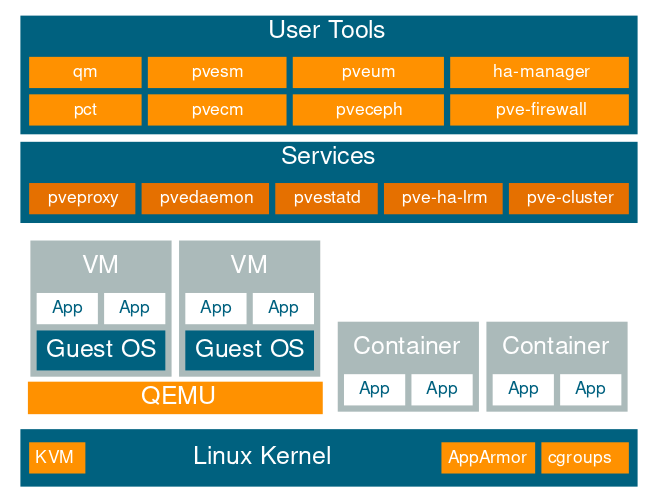

第一章： 前言
===============

Proxmox VE是一个运行虚拟机和容器的平台，基于Debian Linux，完全开源。拥有强大的虚拟化能力，配置了基于内核的虚拟机(KVM)和容器(LXC)。
其设计目标是，使管理尽可能简单。你可以通过Proxmox VE登陆节点，或者集群中的所有节点。所有的管理任务都可以通过web进行操作，甚至于一个新手都可以在几分钟时间启动和安装Proxmox VE。

.. toctree::
   :maxdepth: 3

   1.1_central_management
   1.2_flexible_storage
