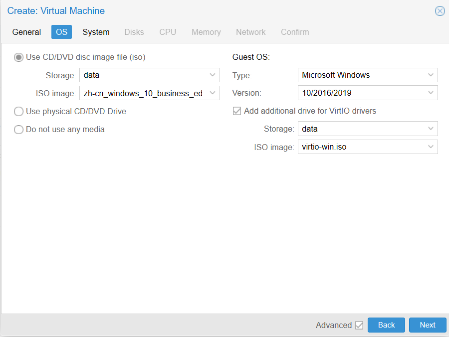
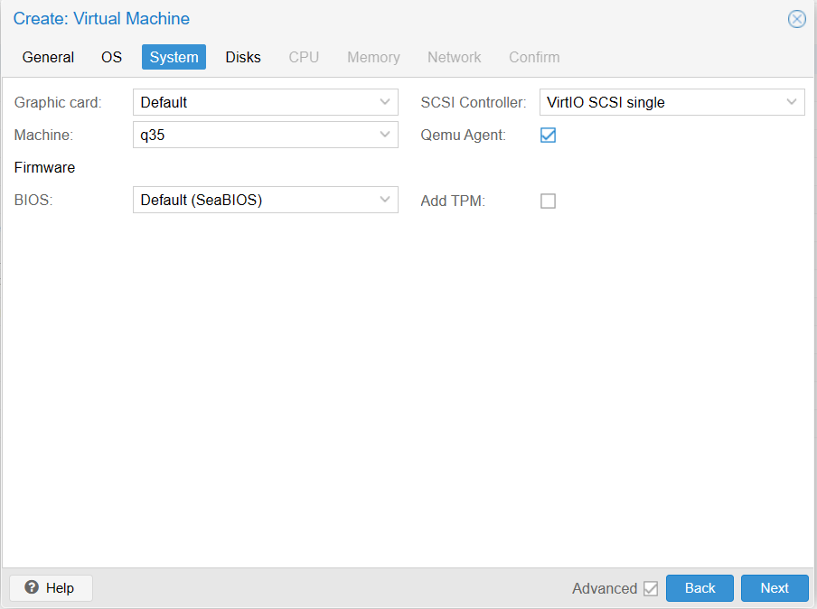
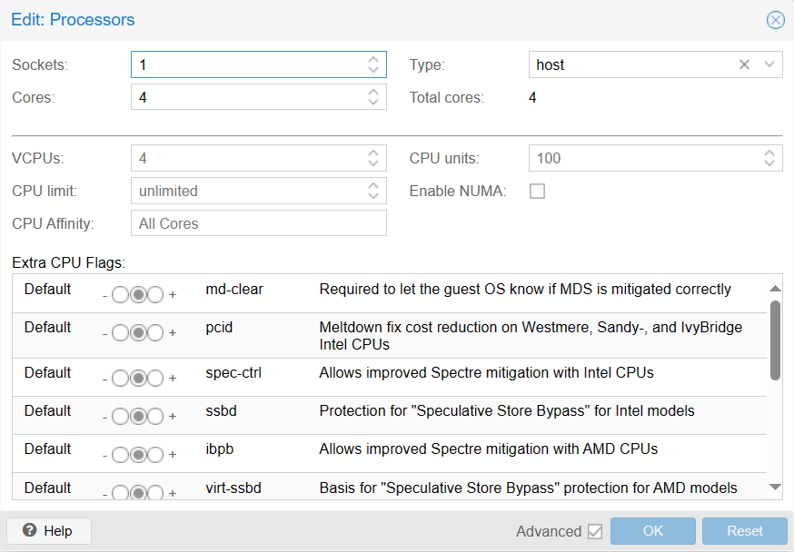
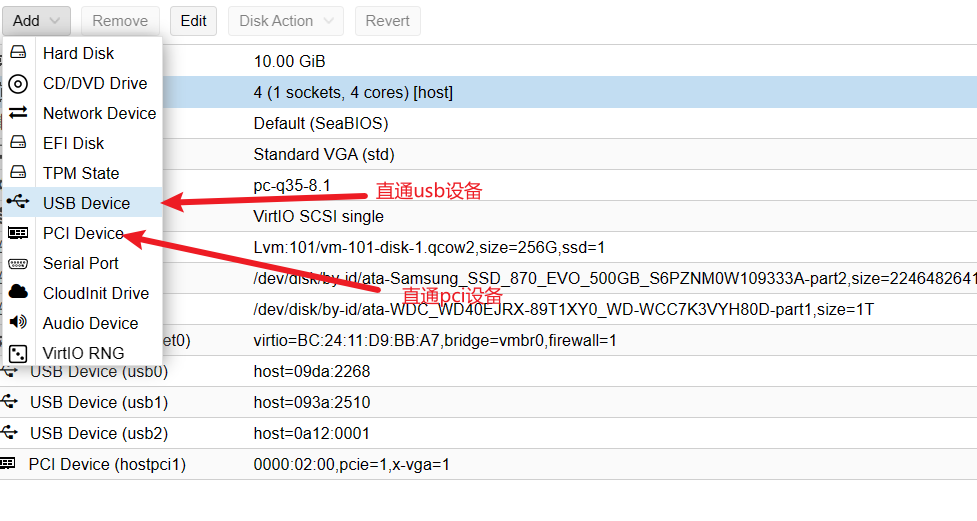
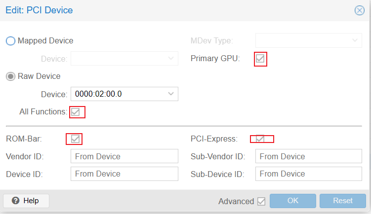
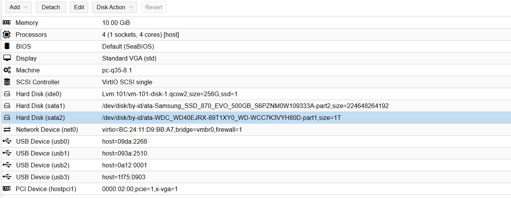

# 创建windows虚拟机并直通硬件和映射分区

此处创建用于直通的方式有两种，一种是安装全新的Windows系统并进行配置，第二种是将磁盘分区映射到虚拟机直接启动旧的Windows系统。第二种方式可以直接将原宿主机操作系统直接启动。

## 1)创建新虚拟机并安装全新系统

### 创建虚拟机

创建虚拟机，并选择启动镜像，添加[virtio-win驱动](https://fedorapeople.org/groups/virt/virtio-win/direct-downloads/archive-virtio/virtio-win-0.1.240-1/virtio-win-0.1.240.iso)，在安装选择磁盘时，看不到硬盘的情况下，需要加载virtio-wim中的驱动后才能看到硬盘。



设备类型选Q35,勾选qemu agent，这样在系统中安装驱动后，可以在pve的vm管理界面看到设备的ip等信息。



cpu选host



其他按需配置

启动虚拟机，正常安装，安装时如果看不到硬盘，点加载驱动，按需要的系统选择，加载后可以看到硬盘，如果碰到无法下一步的情况，先格式化分区，在删除，然后重启虚拟机在进行引导安装。

安装后启动虚拟机，进入系统后安装virtio-win-guest-tools，安装后就可以链接网络。安装后，关闭虚拟机，添加显卡等设备。

### 直通显卡，键鼠等设备



直通显卡勾选选项,Display选项我是选的VGA，因为使用defaults的话，锁屏一段时间后虚拟机可能会被暂停。



## 2)映射磁盘分区以使用原宿主机系统

创建一个新的虚拟机，将默认创建的硬盘删除并且对分区进行映射，映射方法：

### 1：查询分区

```
root@pve:~# ls /dev/disk/by-id
ata-Samsung_SSD_870_EVO_500GB_S6PZNM0W109333A  
ata-Samsung_SSD_870_EVO_500GB_S6PZNM0W109333A-part1
ata-Samsung_SSD_870_EVO_500GB_S6PZNM0W109333A-part2 
ata-Samsung_SSD_870_EVO_500GB_S6PZNM0W109333A-part3  
ata-WDC_WD40EJRX-89T1XY0_WD-WCC7K3VYH80D 
ata-WDC_WD40EJRX-89T1XY0_WD-WCC7K3VYH80D-part1
ata-WDC_WD40EJRX-89T1XY0_WD-WCC7K3VYH80D-part2
```

### 2：映射分区

其中`-part*`表示分区，不带`-part`为整块硬盘。举例：

如果你原宿主机windows是安装在`ata-WDC_WD40EJRX-89T1XY0_WD-WCC7K3VYH80D`这块硬盘上，有C和D分区，那么查询出来的分区就如上情况。如果想将整个硬盘映射到虚拟机中，假如创建的空白虚拟机ID101,那么根据以下命令，就可以映射到虚拟机中

```
qm set 101 -sata1 /dev/disk/by-id/ata-WDC_WD40EJRX-89T1XY0_WD-WCC7K3VYH80D
```

`101`是虚拟机ID，`-sata1`是映射使用的通道和通道id，不同分区需要不同id。比如，现在映射两个分区进虚拟机

```
qm set 101 -sata1 /dev/disk/by-id/ata-Samsung_SSD_870_EVO_500GB_S6PZNM0W109333A-part1
qm set 101 -sata2 /dev/disk/by-id/ata-WDC_WD40EJRX-89T1XY0_WD-WCC7K3VYH80D-part1
```

这时，虚拟机会有两个硬盘下的两个分区。在web管理界面就可以看到,这两个分区已经分配到虚拟机中了。


## 3)灵活配置

两种方式并非二选一，映射和创建全新系统可以同时存在，以下为我现在使用的方式




其中两个分区是原宿主机windows下的分区，两个sata通道的使用旧分区，很多文件在上面，不需要来回搬运文件，映射后直接使用。vm-101-disk-1.qcow2是新创建的磁盘安装系统。

我使用这种方法，将工作用的设备进行了改造，显卡键鼠直通，稳定运行，并且在初期测试稳定性时，通过直通保留了旧系统一段时间，在遇到不稳定或有其他问题时，可以重启宿主机并快速切换至旧windows系统，不耽误工作。目前已经稳定运行2月时间，旧系统在转移文件后就可以清楚掉腾出空间了。

至于改造原因，我在运维工作中，时常需要创建很多虚拟机进行试验，但是windows宿主机在办公中总是有很多情况需要重启，我就要暂停，重启，在启动，有时候虚拟机启动后还会出现时间不自动同步问题，尤其是偶尔蓝屏，炸炸。改造后，还可以进行快照，备份，再也不用担心工作环境丢失了。

[pve拓扑结构见](https://hjg-blog.readthedocs.io/en/latest/pve/use_pve_host.html)

