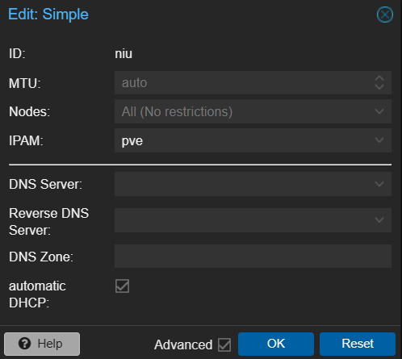
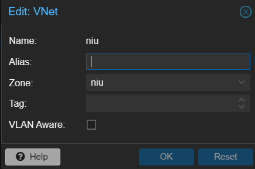
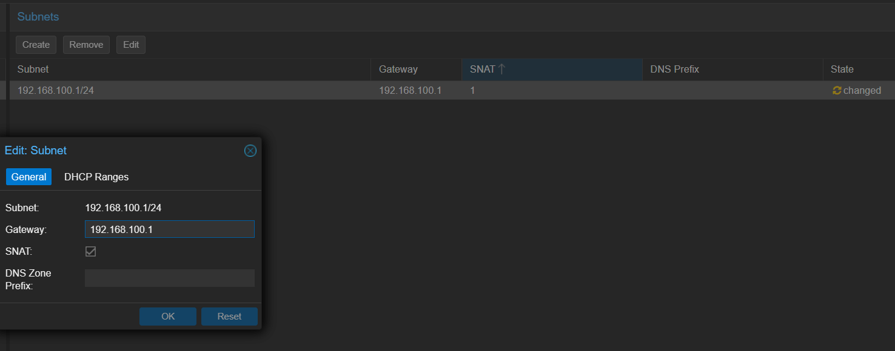
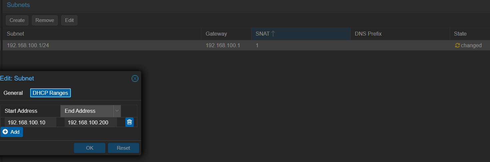
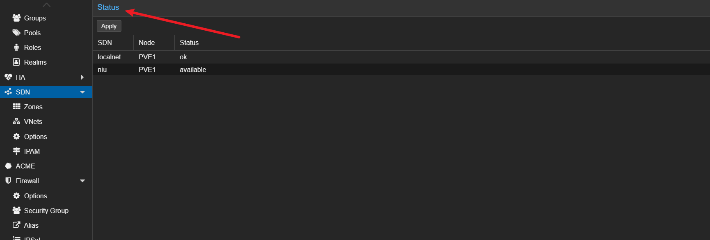
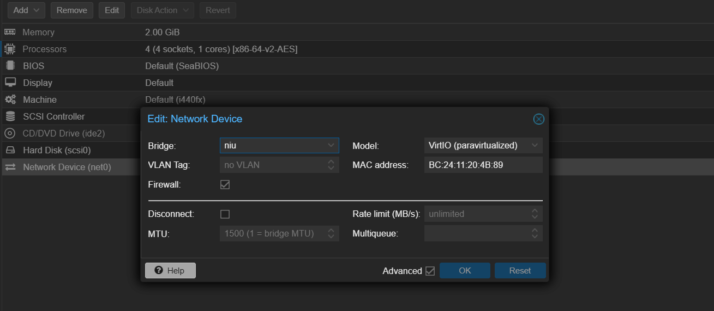

# 在pve中，通过SDN快速创建局域网

## 场景

在只有一个公网IP并分配给PVE宿主机的情况下，创建的虚拟机需要通过创建虚拟局域网获取内网ip，可以使用pve8以后新添加的SDN功能，快速创建虚拟机的局域网，并配置dhcp

## 创建zones

在DataCenter》SDN》Zones创建一个simple网络，选中automatic DHCP自动分配网址

然后在VNets创建一个Vnet，zone选择上面创建的simple

创建好后，选中，在subnets创建局域网的网段和dhcp范围，勾选SNAT使局域网可以连互联网。

dhcp一定要填，不然后面创建虚拟机时选你创建的zones会报错没有ip分配。

创建好后回到SDN，点击apply应用。

等待几秒，status变未available，就可以在虚拟机添加网络使用了

