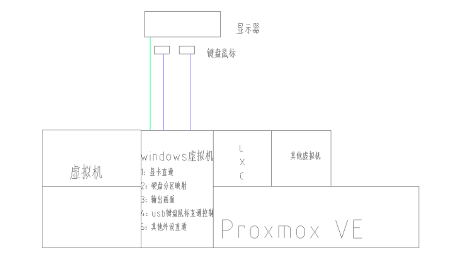

# 基于pve部署虚拟机直通外设

​	在工作中遇到一个问题，如果在使用中频繁需要重启系统会很麻烦，比如打开文件需要保存，正在运行的虚拟机需要暂停或停止。为了解决这一问题，我决定对我的工作系统进行改造，使用pve虚拟化，将工作系统放进虚拟机，并将外设直通来解决这个问题。

## 架构拓扑

拓扑如下

1：使用PVE做宿主系统。

2：创建一个Windows虚拟机，然后将显卡外设等直通给Windows虚拟机，这样就可以通过外设和显示来操作。

3：通过硬盘分区映射将逻辑硬盘上的分区映射到Windows虚拟机，来解决虚拟化系统对性能的影响，同时避免因改造带来的文件搬运带来的麻烦（是的，你可以完整保留

4：保留引导的同时可以通过引导随时切换虚拟机和Windows宿主机。

5：按需创建自己需要的虚拟机，此时如果需要重启Windows，对其他虚拟机没有影响。

在工作系统需要重启时，仅需重启虚拟机无需重启主机，并且虚拟化环境更统一给安装操作系统等操作更便捷。

## 实际体验

配置1：

| cpu  | I3-9350KF      |
| ---- | -------------- |
| 主板 | 华擎 Z390-Pro4 |
| 显卡 | 讯景 RX580     |

配置2：

| cpu  | I5-12400F  |
| ---- | ---------- |
| 主板 | 铭瑄H610m  |
| 显卡 | 讯景 RX480 |

1：硬件1配置目前在做工作主机，实际体验下来，日常办公没有问题。

2：硬件2配置为测试时使用的设备，不知道是不是兼容性原因，实际使用时会出现鼠标卡顿问题。

3：不同硬件直通后效果不同，比如配置2，可以正常显示到pve的登陆界面，但是配置1到加载init时就卡在那里了（不确定是不是配置参数的问题）。

4：如果映射的windows分区大于1，会出现分区在重启后排序错乱的情况。

5：使用的讯景显卡，显卡控制面板无法打开，不清楚是直通问题还是软件兼容问题，面板无法打开会出现显卡调式问题，如风扇控制，温度控制这些。使用不方便。

6：使用达芬奇生产软件，可以看到gpu有负载，无付费版，无法测试纯GPU跑会有什么问题。

