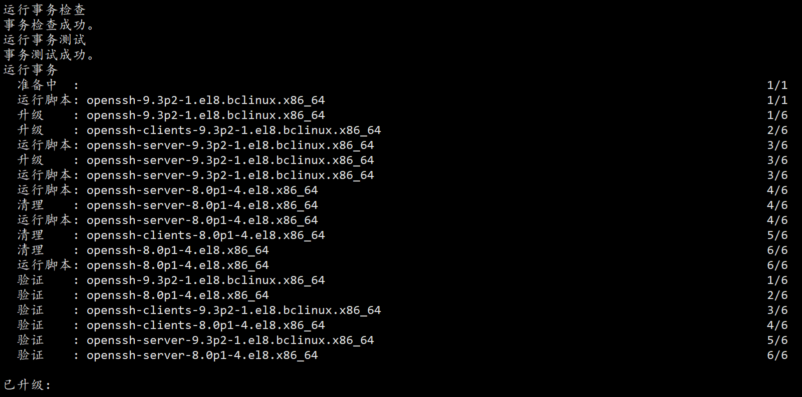

# BCLinux8.2 rpm包升级openssh

time: 2024/1/6

工作中有大量设备需要升级openssh，将openssh打包成rpm，便于分发安装

## 检查环境

```
$ssh -V
OpenSSH_8.0p1, OpenSSL 1.1.1c FIPS  28 May 2019
```

在编译openssh时，特意查询openssh需要的最低openssl版本，openssh网站并未查询到，再其源码的spec中看到

> BuildRequires: openssl-devel >= 1.0.1
>
> BuildRequires: openssl-devel < 1.1

编译支持的openssl-devel在1.0.1和1.1之间，现在最新版本是1.1.1w。后面是小版本号，不用3版本，应该没问题。

## 上传rpm包

[openssh-9.3p2-1.el8.bclinux.x86_64.rpm](https://github.com/bt7-vip/note/blob/main/docs/source/work/typora-user-images/openssh-9.3p2-1.el8.bclinux.x86_64.rpm)

[openssh-clients-9.3p2-1.el8.bclinux.x86_64.rpm](https://github.com/bt7-vip/note/blob/main/docs/source/work/typora-user-images/openssh-clients-9.3p2-1.el8.bclinux.x86_64.rpm)

[openssh-server-9.3p2-1.el8.bclinux.x86_64.rpm](https://github.com/bt7-vip/note/blob/main/docs/source/work/typora-user-images/openssh-server-9.3p2-1.el8.bclinux.x86_64.rpm)


## 备份文件

```shell
$cp /etc/pam.d/sshd /etc/pam.d/sshd.bak
```

## 开始安装

```shell
$ sudo yum localinstall openssh-9.3p2-1.el8.bclinux.x86_64.rpm openssh-clients-9.3p2-1.el8.bclinux.x86_64.rpm openssh-server-9.3p2-1.el8.bclinux.x86_64.rpm
```



## 恢复文件权限

安装后进行sshd重启，不出意外，应该是失败的，使用status查询

```shell
$systemctl status sshd
```


是权限太大了，修改权限后，重启sshd

```
$sudo chmod 0600 /etc/ssh/*key
$sudo chmod 0640 /etc/ssh/*pub
$systemctl restart sshd
$systemctl status sshd
```

不出意外的话，你最好没有退出shell。

## 恢复服务

做完以上操作后，如果你没测试在其他端口登录一次，那么恭喜你，进不去了。如果你旧窗口还在，在新窗口登录失败后，会看到一条日志

```
error: Could not get shadow information for xxx
```

需要做以下修改

### 恢复配置文件

```
$cp /etc/pam.d/sshd.nak /etc/pam.d/sshd
```

### 修改配置文件

```
$vim /etc/ssh/sshd_config
...
usePAM yes
...
```

重启sshd，皆大欢喜！！！！
