# fedora41workstation升级故障处理

### 现象

update后，重启系统，黑屏只显示一个光标在闪。


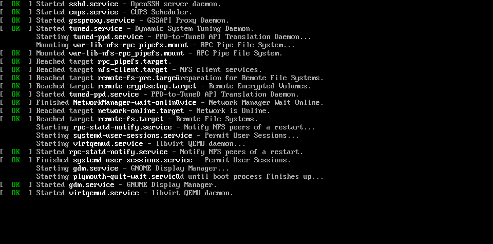


### 原因

软件兼容问题，降级mesa相关软件包

### 处理办法

`ctrl`+`alt`+F2进入字符界面，登陆系统，降级软件包。

```shell
sudo dnf install mesa-filesystem-24.2.4-1.fc41.x86_64
```

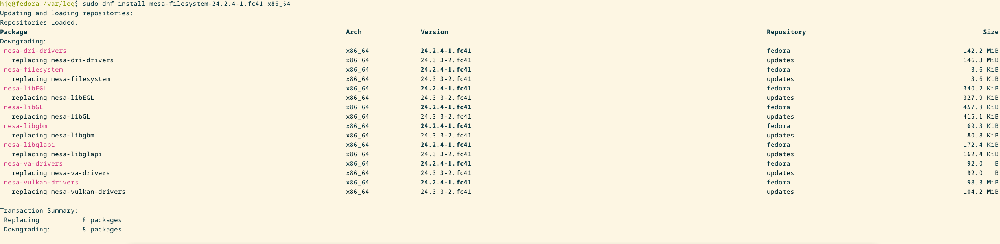

### 排障过程

1：虚拟机快照恢复--之前未创建过任何快照。 失败

2：可ping通，尝试ssh登陆（为了验证系统已经正常启动）--未设置过sshd开机启动。失败

3：进入维护模式

  进入维护模式后，尝试查看日志进行排查message和kernel日志均不存在。

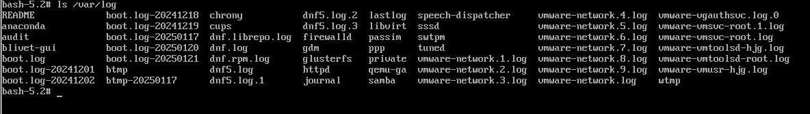

并且`/boot` 下只有一个旧内核的

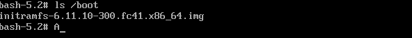

当时怀疑是没有`chroot`进入到系统，`mount -a` 后硬盘正常挂载，还是没有日志，还对boot进行了重建，事实证明这不是一个对的方向。

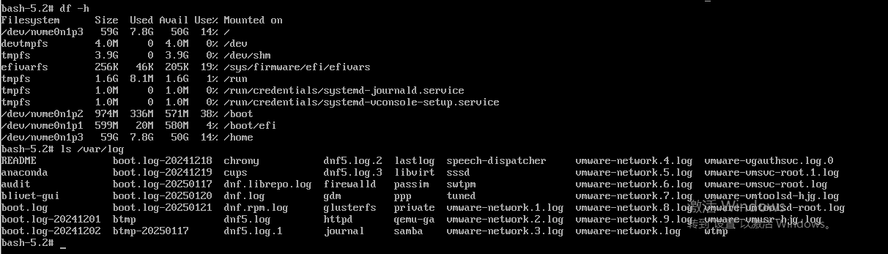

没有日志就没办法看到底是那里起不来。止步不前。。。。。

### 初现端倪

中间隔了一段时间，忽然想到一个问题，是不是桌面没有起来，所以尝试进入到tty界面。

`ctrl`+`Alt`+F2切换。失败，正常情况是成功的，但是我是用remmina远程，这三个按键触发在本地。尝试在开机时进入字符界面

#### 开机进入字符界面

添加启动参数`systemd.unit=multi-user.target`

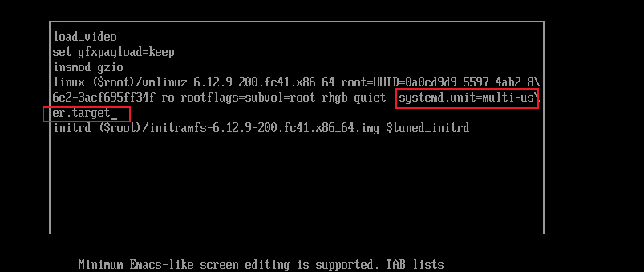

 ..note::

  如果像我一样进入字符界面不方便，并且需要反复重启机器验证，可以将默认启动方式改为字符界面，确保系统可以正常启动

```shell
# 查询当前启动方式
systemctl get-default
# 设置默认启动方式
systemctl set-default multi-user.target # 字符界面
systemctl set-default graphical.target #桌面
```

按`ctrl`+x 进入系统

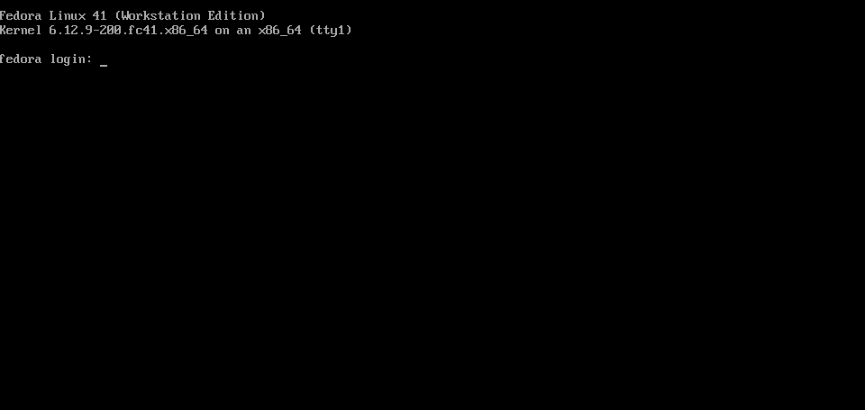

进入系统后配置sshd，这样就可以ssh登陆系统进行排查。

遗憾的是，还是没有message日志，只能通过`journalctl` 来看，但是并没有记录到明显错误

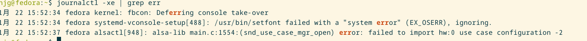

#### 排查桌面服务

到这里其实可以确定，是桌面没起来，没有日志只是不方便排查，但并不是没有方向。

确定使用的显示器管理器

```shell
ps aux | grep -E "gdm|sddm|lightdm"
```

正常情况是没有进程，并不能看到管理器是那个，因为我们的桌面本来就没起来。。。

那就看看我们系统有那个包

```shell
rpm -qa | grep gdm
rpm -qa | grep sddm
rpm -qa | grep lightdm
```

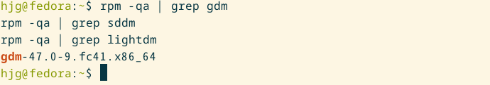

明显就这一个gdm，看下进程

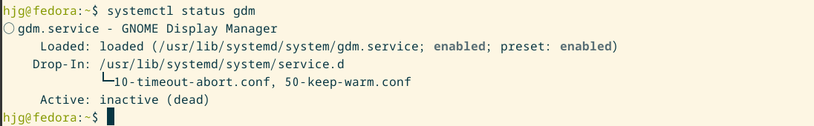

启动起来

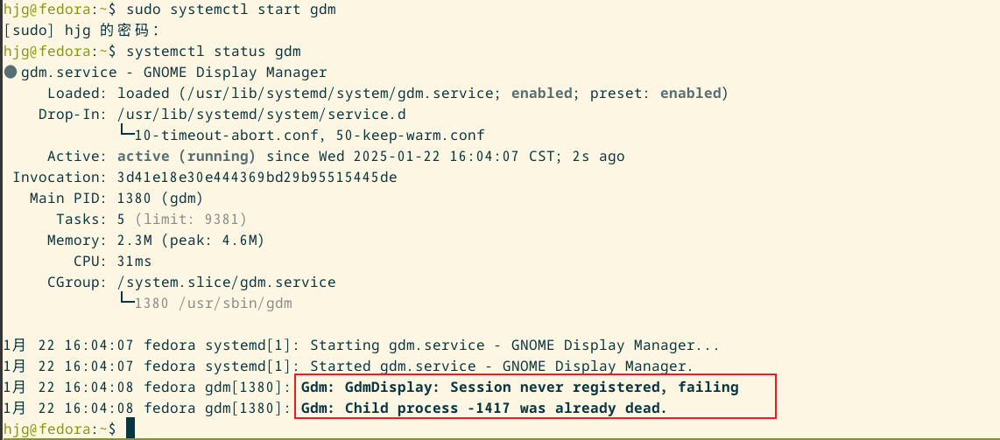

报错不就来了，哈哈哈哈。。。。。

#### 问题搜索

通过关键字搜索，可以找到fedora论坛已经有人遇到这个问题，并且给出了解决方法，应该是一个兼容性问题

[VMware Fedora 41 black screen after dnf upgrade](https://discussion.fedoraproject.org/t/vmware-fedora-41-black-screen-after-dnf-upgrade/141793)

### 系统恢复

#### 回滚安装包

回滚很方便

```shell
sudo dnf install mesa-filesystem-24.2.4-1.fc41.x86_64
```

dnf自动解决依赖，所以会连同其他包一起回滚

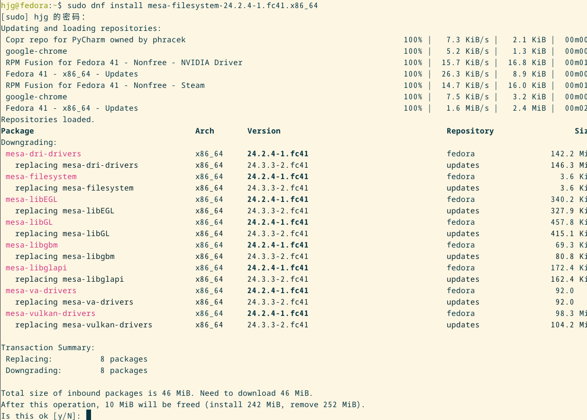

安装完成后重启，正常进入系统

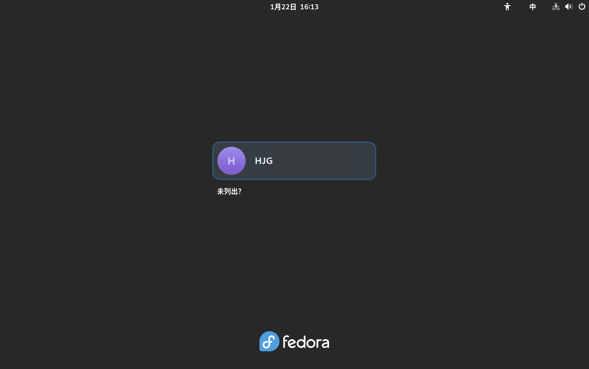

### 总结

  第一次遇到这种情况，当时认为系统是没有成功启动，因为在升级时看到有显卡驱动，怀疑是驱动问题，所以排查方向是进入维护模式进行排查。并且没有日志，排查难度增加。过了两天才想到是不是桌面没起来，尝试ping，ping正常。转换思路，进入字符界面验证，结果确实是进入了系统，之后的问题搜索和降级包算是水到渠成。


2025/01/26 今天更新系统特意看了下mseg版本，发现还是升级到24.3.3但是重启正常进桌面，说明这个问题已经解决了。
