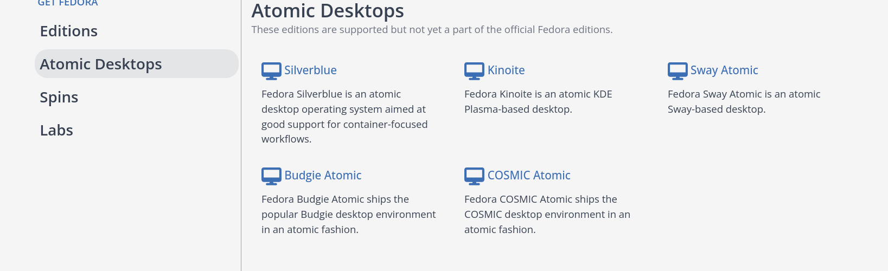
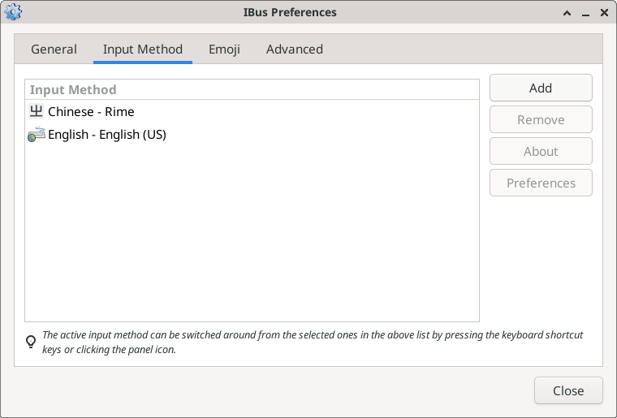
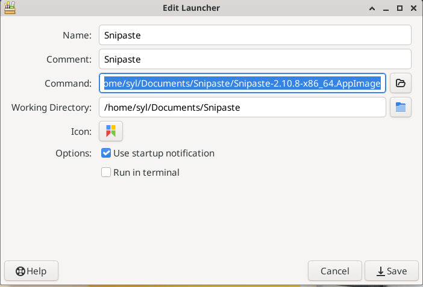
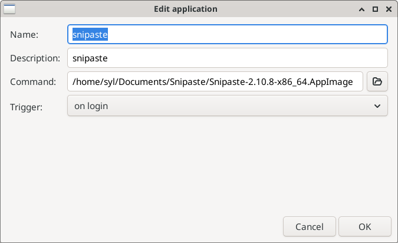

# fedora atomic xfce安裝与配置
## 前言
### 什么是 Fedora Atomic Desktops？
简单来说，它的核心系统大部分是只读的，这意味着应用程序和常规操作无法意外修改或破坏关键的系统文件。
这种模式带来了几大核心优势：
  * 原子更新 (Atomic Updates):
     系统更新要么完全成功，要么完全不生效，从而杜绝了在更新过程中因断电、网络中断等问题导致系统损坏的风险。
   * 轻松回滚 (Easy Rollbacks):
     如果某次更新（例如驱动程序或系统组件）导致了问题，您只需重启便可轻松“回滚”到更新前的上一个工作状态，就像拥有了系统级的“撤销”按钮。
   * 清晰的隔离 (Clean Separation): 
    系统与应用程序被清晰地分离开来。您可以通过 Flatpak、  Toolbox容器等现代化技术来安装和管理软件，这既保证了应用的独立性，又不会“污染”或搞乱您的主系统。

```{note}
目前官方并未推出xfce正式版，只有测试版，所以这次是先安装其他桌面版本后切换到xfce桌面，这里记录了切换桌面过程和配置一些软件。
```

## 安装atomic系统
在[fedora官网](https://fedoraproject.org/)，下载 Fedora Atomic 系统镜像。

按照正常操作安装系统
### 升级系统到最新
升级系统到最新版本
```shell
sudo rpm-ostree cleanup
sudo rpm-ostree upgrade
```
升级完成后，重启系统
```shell
sudo systemctl reboot
```

### 安装xfce桌面环境
安装xfce桌面
```shell
sudo rpm-ostree rebase ostree-unverified-registry:quay.io/fedora-ostree-desktops/xfce-atomic:43
```
**注意：** 系统版本要和自己的预期版本一致。
等待安装完成后，重启系统
```shell
sudo systemctl reboot
```
无需担心原有桌面环境，随后的系统升级将自动清理并替换它。如果安装新的桌面体验不好，可以`sudo rpm-ostree rollback`一键回滚。

## 系统配置
### 1. 安装和配置系统相关软件
```shell
# 安装输入法，tmux和远程桌面服务
sudo rpm-ostree  install ibus-rime tmux xrdp 
# 卸载系统的noopenh246占位包，解决视频和远程桌面编码解码问题
sudo rpm-ostree override remove noopenh264 --install openh264 --install mozilla-openh264
```
#### - 配置ibus
  - 默认安装的xfce是原版桌面，没有经过特定配适，与安装发行版的桌面有些不同。ibus已经安装，可以添加自己喜欢的输入法，这里以中州韵为例
  - 前面已经安装了中州韵的输入法，启动ibus和开机启动守护程序
```shell
# 手动后台运行守护程序，托盘可以看到图标
ibus-daemon -d
```
 -  配置输入法方案
     鼠标右键点击 ibus 图标，选择 Preferences > Add > Chinese > Rime
    
    配置后左键点击ibus图标切换到rime方案，`F4` 快捷键唤出，配置简体中文方案。

 - 配置开机启动
   Applications > Settings > Session and Startup > Application Autostart > Add 
   配置如下
   ![[./typora-user-images/file-20251129221431716 1.png]]
#### - 配置Xrdp
 - 配置远程桌面服务
```shell
# 配置开机启动
sudo systemctl enable --now xrdp
# 防火墙放行
sudo firewall-cmd --permanent --add-service=rdp
sudo firewall-cmd --reload
```

- 配置登录session
```shell
$ vi ~/.xsession
#!/bin/sh
# 这里不要用dbus-launch的方式，那样会造成远程桌面使用toolbox失败
# 強制將 D-Bus 指向 Systemd 管理的 Socket
# 這讓 Podman 能找到正確的 systemd --user 實例
export DBUS_SESSION_BUS_ADDRESS="unix:path=/run/user/$(id -u)/bus"

# 導入其他的環境變數 (可選，但推薦)
[ -f /etc/profile ] && . /etc/profile
[ -f ~/.bashrc ] && . ~/.bashrc

# 啟動 XFCE 桌面
exec /usr/bin/startxfce4
```

- 增加执行权限
```shell
chmod +x ~/.xsession
```

现在可以测试rdp能否登录。

## 软件安装和配置
### 1. 安装和配置开发相关软件
#### - Toolbox
Toolbox是一个开发工具，用于快速部署开发环境，且与原子化系统设计理念兼容，能够弥补系统开发工具的不足。
- 创建一个默认环境
```shell
toolbox create
# 查询列表
toolbox list
# 进入容器环境
toolbox enter
```

- 创建一个指定系统环境
目前支持4种发行版`arch`，`fedora`，`rhel`，`ubuntu`，
```shell
# 创建radhat 10.0环境
toolbox create --distro rhel --release 10.0
# 进入指定容器
toolbox enter rhel-toolbox-10.0
```

#### - 安装和配置vscode
vscode 可以使用flatpak方式安装，但是vscode在flatpak仓库中不是官方维护，可以在toolbox创建的环境中安装。
- 进入一个容器
```shell
toolbox enter
# 更新系统
sudo dnf update -y 
# 安装输入法, 安装后才可以对容器内GUI应用中输入中文，只需安装软件，无需重新配置。
sudo dnf install ibus ibus-rime
```

- 下载[vscode安装包](https://code.visualstudio.com/Download),根据容器的实际发行版下载对应的包
**说明：** 值得注意的是，Toolbox创建的环境更像是开发环境容器化，文件和工具可以与系统共享访问，并且支持部署 GUI开发工具。
```shell
# 这里以fedora发行版为例
# 下载的rpm包在Downloads文件夹下
cd Downloads
sudo dnf install ./code-1.106.3-1764110935.el8.x86_64.rpm -y
```
安装完成后，可以在容器里直接启动vscode
```shell
code
```
- 配置启动快捷键
在容器中，复制快捷图标到桌面，看不见新增图标的，在桌面空白处右键 > arrange desktop icons
```shell
cp /usr/share/applications/code.desktop ~/Desktop/
```
 准备一个vscode的ico文件，在桌面选中后编辑，icon选刚刚的图片, 启动命令`toolbox run -c fedora-toolbox-43 code` 其中`-c` 参数指定了容器名称，**这里的容器名称建议使用容器ID**,以确保其唯一性和稳定性，另外的原因是容器名可以随时修改，ID查看方式为`toolbox list`命令, 会列出当前镜像和容器。
 
保存后，双击运行测试运行是否正常。
在配置中文界面时可能会遇到字体是方块，在容器中安装中文字体
```shell
sudo dnf install wqy-zenhei-fonts
# 供参考，可以安装自己喜欢的字体
```

#### - Podman Desktop
potdman desktop已不提供二进制包，使用flatpak安装
- 添加flathub用户源
```shell
flatpak remote-add --if-not-exists --user flathub https://flathub.org/repo/flathub.flatpakrepo
```
-  安装podman desktop
 ```shell
  flatpak install --user flathub io.podman_desktop.PodmanDesktop
  ```
  等待安装完成，文件真的很大
### 2. 日常软件配置
#### - Obsidian
对于常用软件，没有严重BUG就使用固定版，这里Obsidian使用appimages打包的版本。在Xwaylay环境有严重BUG，白板无法拖动，需要在X11环境运行。
-  下载软件包[Download](https://obsidian.md/)和[图标](https://obsidian.md/images/obsidian-logo-gradient.svg)
- 创建一个文件夹放置软件包和图标，并将软件包配置运行权限。
- 桌面空白处右键> create launcher


#### - Snipaste
强大的截图工具，用上就停不下来的那种。
-  下载[软件包](https://www.snipaste.com/download.html)和[图标文件](https://www.snipaste.com/img/logo.svg)
-  创建文件夹并放置软件包和图标
-  桌面空白处右键> create launcher

- 配置开机启动
 Applications > Settings > Seesion and Startup > Application Autostart > Add 
 
-  配置快捷键，托盘图标无法唤出配置菜单
```shell
$ cd ~/.snipaste/
vi config.ini
[hotkeys]
snip="134217793, 134217793"
```
如果对配置文件编写不熟悉，或者已有 Windows 环境下的配置，可以在 Windows系统中配置好快捷键后，将 config.ini 文件复制到此处。

```{note}
  目前已经使用atomic系统大约半个月，桌面配置从以前的工作环境导入进来，UI可以做到一键恢复。在配置好软件后，使用上没有多少差异,偶尔有些场景会出现严重卡顿，不建议作为正式的使用环境。有些软件需要额外安装，测试版没有很多预装软件。
```
