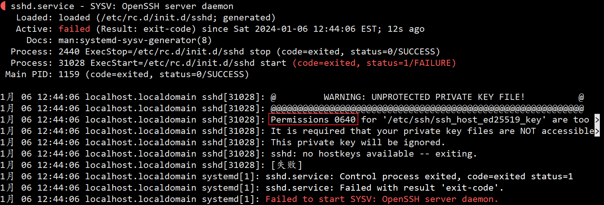

# BCLinux8.2 rpm包升级openssh

工作中有大量设备需要升级openssh，将openssh打包成rpm，便于分发安装

## 检查环境

```
$ssh -V
OpenSSH_8.0p1, OpenSSL 1.1.1c FIPS  28 May 2019
```

在编译openssh时，特意查询openssh需要的最低openssl版本，openssh网站并未查询到，再其源码的spec中看到

> BuildRequires: openssl-devel >= 1.0.1

> BuildRequires: openssl-devel < 1.1

编译支持的openssl-devel在1.0.1和1.1之间，现在最新版本是1.1.1w。后面是小版本号，不用3版本，应该没问题。

## 上传rpm包

```
openssh-9.3p2-1.el8.bclinux.x86_64.rpm
openssh-clients-9.3p2-1.el8.bclinux.x86_64.rpm
openssh-server-9.3p2-1.el8.bclinux.x86_64.rpm
```

## 开始安装

```
$ sudo yum localinstall openssh-9.3p2-1.el8.bclinux.x86_64.rpm openssh-clients-9.3p2-1.el8.bclinux.x86_64.rpm openssh-server-9.3p2-1.el8.bclinux.x86_64.rpm
```


## 恢复文件权限

安装后进行sshd重启，不出意外，应该是失败的，使用status查询

```
$systemctl status sshd
```



是权限太大了，修改权限后，重启sshd

```
$sudo chmod 0600 /etc/ssh/ssh_host_ed25519_key
$systemctl restart sshd
$systemctl status sshd
```

不出意外的话，应该好了。

[openssh-9.3p2-1.el8.bclinux.x86_64.rpm](https://github.com/bt7-vip/note/blob/main/docs/source/work/openssh-9.3p2-1.el8.bclinux.x86_64.rpm)

[openssh-clients-9.3p2-1.el8.bclinux.x86_64.rpm](https://github.com/bt7-vip/note/blob/main/docs/source/work/openssh-clients-9.3p2-1.el8.bclinux.x86_64.rpm)

[openssh-server-9.3p2-1.el8.bclinux.x86_64.rpm](https://github.com/bt7-vip/note/blob/main/docs/source/work/openssh-server-9.3p2-1.el8.bclinux.x86_64.rpm)
